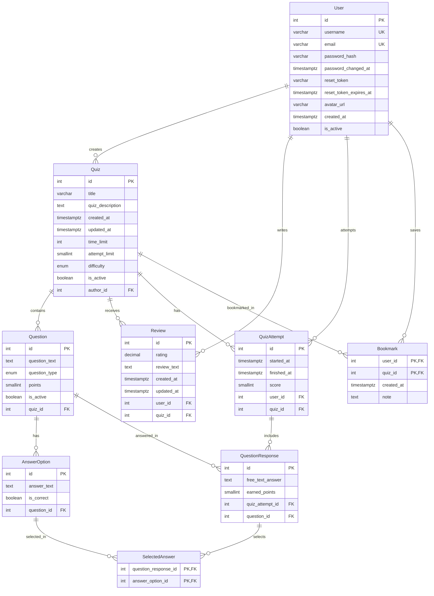

# Database Schema Documentation

## Overview

The Quiz System database consists of **9 main tables** implementing a normalized relational structure for managing quizzes, users, attempts, reviews, and bookmarks. The schema follows **Third Normal Form (3NF)** principles to ensure data integrity and minimize redundancy.

---

## Entity-Relationship Diagram (ERD)



---

## Table Descriptions

### 1. User Table

**Purpose:** Stores user account information with authentication and soft delete support.

**Columns:**

| Column | Type | Constraints | Description |
|--------|------|-------------|-------------|
| id | SERIAL | PRIMARY KEY | Auto-incrementing user identifier |
| username | VARCHAR(32) | UNIQUE, NOT NULL | Unique username (3-32 chars) |
| email | VARCHAR(255) | UNIQUE, NOT NULL | Email address for login |
| password_hash | VARCHAR(255) | NOT NULL | Bcrypt hashed password |
| password_changed_at | TIMESTAMPTZ | NULL | Last password change timestamp |
| reset_token | VARCHAR(255) | NULL | SHA-256 hashed password reset token |
| reset_token_expires_at | TIMESTAMPTZ | NULL | Reset token expiration time |
| avatar_url | VARCHAR(255) | NULL | Profile picture URL |
| created_at | TIMESTAMPTZ | DEFAULT NOW() | Account creation timestamp |
| is_active | BOOLEAN | DEFAULT true | Soft delete flag |

**Indexes:**
- `User_username_key` - UNIQUE index on `username`
- `User_email_key` - UNIQUE index on `email`
- `User_reset_token_reset_token_expires_at_idx` - Composite index for password reset lookups

**Relationships:**
- One-to-Many with `Quiz` (a user can create multiple quizzes)
- One-to-Many with `Review` (a user can write multiple reviews)
- One-to-Many with `QuizAttempt` (a user can attempt multiple quizzes)
- Many-to-Many with `Quiz` through `Bookmark` (a user can bookmark multiple quizzes)

**Design Decisions:**
- `password_hash` stores bcrypt hash (never plain text)
- `reset_token` stores SHA-256 hash for security
- `is_active` enables soft delete for data retention
- Separate `password_changed_at` to invalidate old JWT tokens

---

### 2. Quiz Table

**Purpose:** Stores quiz metadata including title, difficulty, and time/attempt limits.

**Columns:**

| Column | Type | Constraints | Description |
|--------|------|-------------|-------------|
| id | SERIAL | PRIMARY KEY | Auto-incrementing quiz identifier |
| title | VARCHAR(255) | NOT NULL | Quiz title |
| quiz_description | TEXT | NULL | Optional description |
| created_at | TIMESTAMPTZ | DEFAULT NOW() | Creation timestamp |
| updated_at | TIMESTAMPTZ | NOT NULL | Last update timestamp |
| time_limit | INTEGER | NULL | Time limit in seconds (NULL = unlimited) |
| attempt_limit | SMALLINT | NULL | Max attempts allowed (NULL = unlimited) |
| difficulty | Difficulty | NULL | Enum: easy, medium, hard |
| is_active | BOOLEAN | DEFAULT true | Soft delete flag |
| author_id | INTEGER | FOREIGN KEY → User(id) | Quiz creator reference |

**Indexes:**
- `Quiz_author_id_idx` - Index on `author_id` WHERE `is_active = true`
- `Quiz_title_idx` - Index on `title` WHERE `is_active = true`
- `Quiz_created_at_idx` - Index on `created_at` WHERE `is_active = true`

**Relationships:**
- Many-to-One with `User` (each quiz has one author)
- One-to-Many with `Question` (a quiz has multiple questions)
- One-to-Many with `Review` (a quiz can have multiple reviews)
- One-to-Many with `QuizAttempt` (a quiz can be attempted multiple times)
- Many-to-Many with `User` through `Bookmark`

**Design Decisions:**
- `time_limit` and `attempt_limit` are nullable for flexibility
- `is_active` enables soft delete without breaking foreign key relationships
- Conditional indexes on `is_active = true` for query performance
- `updated_at` auto-updates via Prisma `@updatedAt`

---

### 3. Question Table

**Purpose:** Stores individual questions belonging to quizzes.

**Columns:**

| Column | Type | Constraints | Description |
|--------|------|-------------|-------------|
| id | SERIAL | PRIMARY KEY | Auto-incrementing question identifier |
| question_text | TEXT | NOT NULL | The question content |
| question_type | QuestionType | DEFAULT 'single_choice' | Enum: single_choice, multiple_choice, free_text |
| points | SMALLINT | DEFAULT 1 | Points awarded for correct answer |
| is_active | BOOLEAN | DEFAULT true | Soft delete flag |
| quiz_id | INTEGER | FOREIGN KEY → Quiz(id) ON DELETE CASCADE | Parent quiz reference |

**Indexes:**
- `Question_quiz_id_idx` - Index on `quiz_id` WHERE `is_active = true`

**Relationships:**
- Many-to-One with `Quiz` (each question belongs to one quiz)
- One-to-Many with `AnswerOption` (a question has multiple answer options)
- One-to-Many with `QuestionResponse` (a question can be answered multiple times)

**Constraints:**
- `points_check` - CHECK constraint: `points >= 0`

**Design Decisions:**
- `question_type` determines how the question is evaluated
- `single_choice` - only one correct answer
- `multiple_choice` - multiple correct answers (all must be selected)
- `free_text` - text comparison with stored correct answer
- CASCADE delete when parent quiz is deleted

---

### 4. AnswerOption Table

**Purpose:** Stores possible answer options for questions.

**Columns:**

| Column | Type | Constraints | Description |
|--------|------|-------------|-------------|
| id | SERIAL | PRIMARY KEY | Auto-incrementing option identifier |
| answer_text | TEXT | NOT NULL | The answer option text |
| is_correct | BOOLEAN | DEFAULT false | Whether this option is correct |
| question_id | INTEGER | FOREIGN KEY → Question(id) ON DELETE CASCADE | Parent question reference |

**Indexes:**
- `AnswerOption_question_id_idx` - Index on `question_id`

**Relationships:**
- Many-to-One with `Question` (each option belongs to one question)
- Many-to-Many with `QuestionResponse` through `SelectedAnswer`

**Design Decisions:**
- For `single_choice` questions: only one option should have `is_correct = true`
- For `multiple_choice` questions: multiple options can have `is_correct = true`
- For `free_text` questions: typically one option with `is_correct = true` stores the correct answer text
- CASCADE delete when parent question is deleted

---

### 5. QuizAttempt Table

**Purpose:** Tracks individual quiz-taking attempts by users.

**Columns:**

| Column | Type | Constraints | Description |
|--------|------|-------------|-------------|
| id | SERIAL | PRIMARY KEY | Auto-incrementing attempt identifier |
| started_at | TIMESTAMPTZ | DEFAULT NOW() | When attempt started |
| finished_at | TIMESTAMPTZ | NULL | When attempt was submitted (NULL = ongoing) |
| score | SMALLINT | NULL | Final calculated score (NULL = not finished) |
| user_id | INTEGER | FOREIGN KEY → User(id) ON DELETE CASCADE | User taking the quiz |
| quiz_id | INTEGER | FOREIGN KEY → Quiz(id) ON DELETE CASCADE | Quiz being attempted |

**Indexes:**
- `QuizAttempt_user_id_quiz_id_idx` - Composite index WHERE `finished_at IS NULL`
- `QuizAttempt_user_id_started_at_idx` - Composite index for user history
- `QuizAttempt_quiz_id_idx` - Index on `quiz_id`

**Relationships:**
- Many-to-One with `User` (each attempt belongs to one user)
- Many-to-One with `Quiz` (each attempt is for one quiz)
- One-to-Many with `QuestionResponse` (an attempt has multiple responses)

**Constraints:**
- `score_check` - CHECK constraint: `score >= 0 AND score <= 100`

**Design Decisions:**
- `finished_at = NULL` indicates ongoing attempt
- Only one ongoing attempt per user per quiz (enforced in application logic)
- `score` calculated when attempt is submitted
- Conditional index on unfinished attempts for performance

---

### 6. QuestionResponse Table

**Purpose:** Stores user's response to individual questions within an attempt.

**Columns:**

| Column | Type | Constraints | Description |
|--------|------|-------------|-------------|
| id | SERIAL | PRIMARY KEY | Auto-incrementing response identifier |
| free_text_answer | TEXT | NULL | User's text answer (for free_text questions) |
| earned_points | SMALLINT | NULL | Points earned for this question |
| quiz_attempt_id | INTEGER | FOREIGN KEY → QuizAttempt(id) ON DELETE CASCADE | Parent attempt reference |
| question_id | INTEGER | FOREIGN KEY → Question(id) ON DELETE CASCADE | Question being answered |

**Indexes:**
- `QuestionResponse_quiz_attempt_id_idx` - Index on `quiz_attempt_id`
- `QuestionResponse_question_id_idx` - Index on `question_id`

**Relationships:**
- Many-to-One with `QuizAttempt` (each response belongs to one attempt)
- Many-to-One with `Question` (each response is for one question)
- One-to-Many with `SelectedAnswer` (a response can select multiple options)

**Design Decisions:**
- `free_text_answer` used only for `free_text` type questions
- `earned_points` calculated based on correctness (partial credit for multiple_choice)
- For choice questions, selected options stored in `SelectedAnswer` table

---

### 7. SelectedAnswer Table

**Purpose:** Junction table linking question responses to selected answer options.

**Columns:**

| Column | Type | Constraints | Description |
|--------|------|-------------|-------------|
| question_response_id | INTEGER | PRIMARY KEY (composite), FOREIGN KEY → QuestionResponse(id) ON DELETE CASCADE | Response reference |
| answer_option_id | INTEGER | PRIMARY KEY (composite), FOREIGN KEY → AnswerOption(id) ON DELETE CASCADE | Selected option reference |

**Primary Key:**
- Composite: `(question_response_id, answer_option_id)`

**Relationships:**
- Many-to-One with `QuestionResponse`
- Many-to-One with `AnswerOption`

**Design Decisions:**
- Implements Many-to-Many relationship between responses and options
- Composite primary key prevents duplicate selections
- No additional columns needed (pure junction table)

---

### 8. Review Table

**Purpose:** Stores user reviews and ratings for quizzes.

**Columns:**

| Column | Type | Constraints | Description |
|--------|------|-------------|-------------|
| id | SERIAL | PRIMARY KEY | Auto-incrementing review identifier |
| rating | DECIMAL(2,1) | NOT NULL, CHECK (rating >= 0 AND rating <= 5) | Rating from 0.0 to 5.0 |
| review_text | TEXT | NULL | Optional review comment |
| created_at | TIMESTAMPTZ | DEFAULT NOW() | Review creation time |
| updated_at | TIMESTAMPTZ | NOT NULL | Last update time |
| user_id | INTEGER | FOREIGN KEY → User(id) ON DELETE CASCADE | User who wrote review |
| quiz_id | INTEGER | FOREIGN KEY → Quiz(id) ON DELETE CASCADE | Quiz being reviewed |

**Indexes:**
- `Review_quiz_id_created_at_idx` - Composite index for quiz reviews by date
- `Review_user_id_idx` - Index on `user_id`
- `Review_user_id_quiz_id_key` - UNIQUE index (one review per user per quiz)

**Relationships:**
- Many-to-One with `User` (each review by one user)
- Many-to-One with `Quiz` (each review for one quiz)

**Constraints:**
- `rating_check` - CHECK constraint: `rating >= 0 AND rating <= 5`
- UNIQUE constraint on `(user_id, quiz_id)` - one review per user per quiz

**Design Decisions:**
- `rating` uses DECIMAL(2,1) for precision (e.g., 4.5)
- UNIQUE constraint prevents duplicate reviews
- `review_text` is optional (user can rate without text)

---

### 9. Bookmark Table

**Purpose:** Junction table for user-saved quizzes with optional notes.

**Columns:**

| Column | Type | Constraints | Description |
|--------|------|-------------|-------------|
| user_id | INTEGER | PRIMARY KEY (composite), FOREIGN KEY → User(id) ON DELETE CASCADE | User reference |
| quiz_id | INTEGER | PRIMARY KEY (composite), FOREIGN KEY → Quiz(id) ON DELETE CASCADE | Bookmarked quiz reference |
| created_at | TIMESTAMPTZ | DEFAULT NOW() | Bookmark creation time |
| note | TEXT | NULL | Optional personal note |

**Primary Key:**
- Composite: `(user_id, quiz_id)`

**Indexes:**
- `Bookmark_user_id_idx` - Index on `user_id`

**Relationships:**
- Many-to-One with `User` (each bookmark belongs to one user)
- Many-to-One with `Quiz` (each bookmark references one quiz)

**Design Decisions:**
- Composite primary key prevents duplicate bookmarks
- `note` field allows users to add personal reminders
- CASCADE delete when user or quiz is deleted

---

## Enumerations

### Difficulty Enum
```typescript
enum Difficulty {
  easy
  medium
  hard
}
```

### QuestionType Enum
```typescript
enum QuestionType {
  single_choice      // One correct answer
  multiple_choice    // Multiple correct answers
  free_text         // Text input comparison
}
```

---

## Normalization Analysis

### First Normal Form (1NF)
✅ All tables contain atomic values
✅ Each column contains values of a single type
✅ Each column has a unique name
✅ No repeating groups

### Second Normal Form (2NF)
✅ Meets 1NF requirements
✅ All non-key attributes are fully dependent on the entire composite primary key
✅ No partial dependencies 

### Third Normal Form (3NF)
✅ Meets 2NF requirements
✅ No transitive dependencies
✅ All non-key attributes depend only on the primary key

**Example:** 
- User email is in `User` table, not duplicated in `Review` or `QuizAttempt`

---

## Indexing Strategy

### Primary Indexes (Automatic)
All `PRIMARY KEY` constraints automatically create unique indexes.

## Index Strategy

### Foreign Key Indexes
Indexes on foreign key columns for JOIN performance:

- **`Quiz` `author_id`** - For finding all quizzes by specific author, used in:
  - Author profile pages showing their quizzes
  - Top authors queries (JOIN User → Quiz)
  - Quiz creation statistics
  
- **`Question` `quiz_id`** - For loading all questions for a quiz, used in:
  - Quiz detail page with questions
  - Quiz attempt preparation
  - Question count aggregations
  
- **`AnswerOption` `question_id`** - For fetching answer options for questions, used in:
  - Displaying question choices to users
  - Answer validation during quiz submission
  - Question editing interface
  
- **`QuizAttempt` `user_id`** - For user's quiz history, used in:
  - User dashboard showing attempt history
  - User performance analytics
  - Top users by score queries
  
- **`QuizAttempt` `quiz_id`** - For quiz popularity metrics, used in:
  - Total attempts per quiz
  - Quiz analytics dashboard
  - Top quizzes by attempts
  
- **`QuestionResponse` `quiz_attempt_id`** - For loading attempt results, used in:
  - Detailed quiz results page
  - Score calculation verification
  - Response review for grading
  
- **`QuestionResponse` `question_id`** - For question-level analytics, used in:
  - Question difficulty analysis
  - Most missed questions report
  - Question performance tracking
  
- **`Review` `user_id`** - For user's review history, used in:
  - User profile showing their reviews
  - Preventing duplicate reviews
  - User contribution tracking
  
- **`Review` `quiz_id`** - For quiz review aggregation, used in:
  - Quiz detail page with reviews
  - Average rating calculations
  - Review count per quiz
  
- **`Bookmark` `user_id`** - For user's bookmarked quizzes, used in:
  - User bookmarks page
  - Bookmark existence checks
  - User saved content management

---

### Composite Indexes

- **`Review` `(quiz_id, created_at)`** - For paginated quiz reviews sorted by date, used in:
  - Quiz review page with newest/oldest sorting
  - Recent reviews widget
  - Review timeline display

- **`QuizAttempt` `(user_id, quiz_id) WHERE finished_at IS NULL`** - For finding ongoing attempts, used in:
  - Checking if user has unfinished attempt before starting new one
  - Resume quiz functionality
  - Abandoned attempt cleanup jobs

- **`QuizAttempt` `(user_id, started_at)`** - For user attempt history ordered by time, used in:
  - User activity timeline
  - Last activity tracking
  - Chronological attempt listing

- **`User` `(reset_token, reset_token_expires_at)`** - For password reset lookups, used in:
  - Password reset token validation
  - Finding user by reset token
  - Expired token cleanup

---

### Conditional Indexes

- **`Quiz` `author_id WHERE is_active = true`** - For active quiz listings by author, used in:
  - Public author profiles (only show active quizzes)
  - Author quiz count (excluding deleted)
  - Top authors rankings

- **`Quiz` `title WHERE is_active = true`** - For searching active quizzes by name, used in:
  - Quiz search functionality
  - Autocomplete suggestions
  - Public quiz directory

- **`Question` `quiz_id WHERE is_active = true`** - For counting active questions per quiz, used in:
  - Quiz metadata (total questions count)
  - Quiz validity checks
  - Question aggregation queries

---

**Rationale:** Conditional indexes reduce index size and improve performance for common queries that filter by `is_active = true`.

---

## Design Decisions & Trade-offs

### 1. Soft Delete Implementation
**Decision:** Use `is_active` boolean flag instead of hard deletes.

**Pros:**
- Preserves data for analytics and audit trails
- Maintains referential integrity
- Allows "undo" functionality

**Cons:**
- Increases query complexity (must filter `is_active = true`)
- Slightly larger database size

**Mitigation:** Conditional indexes on `is_active = true` improve query performance.

---

### 2. Score Storage
**Decision:** Store calculated `score` in `QuizAttempt` table.

**Pros:**
- Fast retrieval without recalculation
- Consistent scoring (prevents recalculation errors)
- Supports historical score tracking

**Cons:**
- Denormalization (score can be derived from `QuestionResponse.earned_points`)
- Must be recalculated if scoring rules change

**Trade-off:** Performance over normalization for frequently accessed data.

---

### 3. Composite Primary Keys
**Decision:** Use composite PKs in `SelectedAnswer` and `Bookmark` tables.

**Pros:**
- Natural keys prevent duplicate entries
- No need for surrogate key
- More efficient queries (no extra JOIN on ID)

**Cons:**
- Slightly more complex foreign key relationships
- Cannot easily reference a single bookmark/selection by ID

**Justification:** These are true junction tables with no independent identity.

---

### 4. Nullable Time/Attempt Limits
**Decision:** Allow `NULL` for `Quiz.time_limit` and `attempt_limit`.

**Pros:**
- Flexibility (unlimited time/attempts)
- Avoids magic numbers (e.g., `-1` for unlimited)

**Cons:**
- Must handle `NULL` checks in application logic

**Mitigation:** Application layer enforces business rules clearly.

---

### 5. Separate `QuestionResponse` and `SelectedAnswer`
**Decision:** Two tables instead of one for answers.

**Pros:**
- Supports multiple answer selections (multiple_choice)
- Cleanly separates free_text answers from selections
- Normalized structure

**Cons:**
- Requires JOIN to get full response
- More tables to manage

**Justification:** Proper normalization for Many-to-Many relationship.

---

## Cascade Behavior

| Parent | Child | Behavior |
|--------|-------|----------|
| User → Quiz | `ON DELETE CASCADE` | Deleting user deletes their quizzes |
| User → Review | `ON DELETE CASCADE` | Deleting user deletes their reviews |
| User → QuizAttempt | `ON DELETE CASCADE` | Deleting user deletes their attempts |
| User → Bookmark | `ON DELETE CASCADE` | Deleting user deletes their bookmarks |
| Quiz → Question | `ON DELETE CASCADE` | Deleting quiz deletes its questions |
| Quiz → Review | `ON DELETE CASCADE` | Deleting quiz deletes its reviews |
| Quiz → QuizAttempt | `ON DELETE CASCADE` | Deleting quiz deletes attempts |
| Quiz → Bookmark | `ON DELETE CASCADE` | Deleting quiz deletes bookmarks |
| Question → AnswerOption | `ON DELETE CASCADE` | Deleting question deletes its options |
| Question → QuestionResponse | `ON DELETE CASCADE` | Deleting question deletes responses |
| QuizAttempt → QuestionResponse | `ON DELETE CASCADE` | Deleting attempt deletes responses |
| QuestionResponse → SelectedAnswer | `ON DELETE CASCADE` | Deleting response deletes selections |
| AnswerOption → SelectedAnswer | `ON DELETE CASCADE` | Deleting option deletes selections |

**Note:** All foreign keys use `ON DELETE CASCADE` to maintain referential integrity and prevent orphaned records.

---

## Data Integrity Constraints

### CHECK Constraints
```sql
-- Review rating must be between 0 and 5
ALTER TABLE "Review" ADD CONSTRAINT "rating_check" 
CHECK ("rating" >= 0 AND "rating" <= 5);

-- Question points must be non-negative
ALTER TABLE "Question" ADD CONSTRAINT "points_check" 
CHECK ("points" >= 0);

-- Quiz attempt score must be between 0 and 100
ALTER TABLE "QuizAttempt" ADD CONSTRAINT "score_check" 
CHECK ("score" >= 0 AND "score" <= 100);
```

### UNIQUE Constraints
- `User.username` - No duplicate usernames
- `User.email` - No duplicate emails
- `Review(user_id, quiz_id)` - One review per user per quiz

---

## Migrations

All schema changes are tracked in Prisma migrations located in `prisma/migrations/`.

**Key migrations:**
1. `20241210_initial_schema` - Base schema creation
2. `20241210_add_bookmark_note` - Added `note` field to Bookmark
3. `20241210_add_password_reset` - Added password reset token fields
4. `20241210_add_indexes` - Added composite and conditional indexes

**To apply migrations:**
```bash
npx prisma migrate deploy
```

---

## Future Considerations

### Potential Schema Enhancements

1. **Question Media**
   - Add `media_url` field to `Question` table for images/videos
   - Add `media_type` enum (image, video, audio)

2. **Quiz Categories/Tags**
   - Create `Category` table
   - Many-to-Many with `Quiz` through `QuizCategory` junction table

3. **User Roles & Permissions**
   - Add `role` enum to `User` (admin, teacher, student)
   - Create `Permission` table for fine-grained access control

4. **Quiz Templates**
   - Add `is_template` field to `Quiz`
   - Add `template_id` foreign key for cloning quizzes

5. **Leaderboards**
   - Create `Leaderboard` table with global/quiz-specific rankings
   - Add `rank` and `percentile` calculated fields

6. **Audit Trail**
   - Create `AuditLog` table for tracking changes
   - Record user actions (created, updated, deleted)

---

**Last Updated:** December 10, 2024
